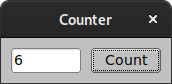
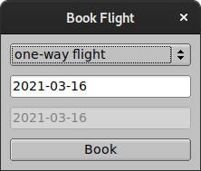
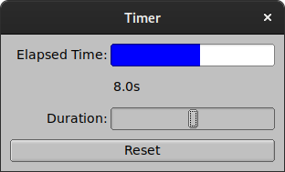
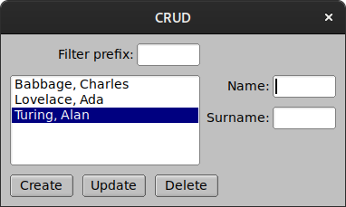
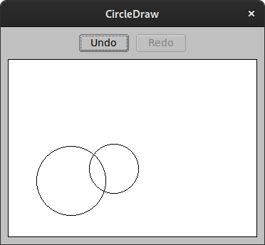

# 7guis-fltk-rs

This is an implementation of [the 7GUIs tasks][0] written in [Rust][1] with
[fltk-rs][2] (bindings to [FLTK][3]).

See [the fltk-rs README][4] for additional dependencies.

[0]: https://eugenkiss.github.io/7guis/
[1]: https://www.rust-lang.org/
[2]: https://github.com/MoAlyousef/fltk-rs
[3]: https://www.fltk.org/
[4]: https://github.com/fltk-rs/fltk-rs/blob/master/README.md#build-dependencies

## counter

```
cargo run --bin counter
```



## temperature

```
cargo run --bin temperature
```


## flightbooker

```
cargo run --bin flightbooker
```



## timer

```
cargo run --bin timer
```



## crud

```
cargo run --bin crud
```



## circles

```
cargo run --bin circles
```



## cells

```
cargo run --bin cells
```


